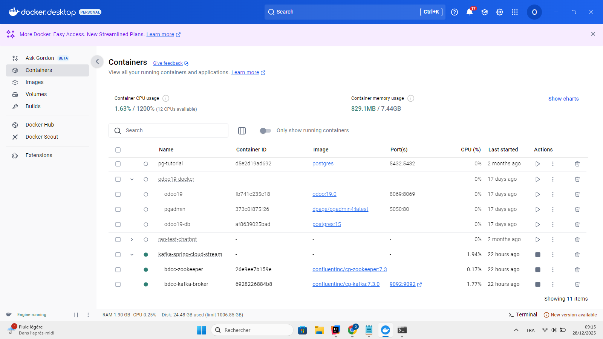
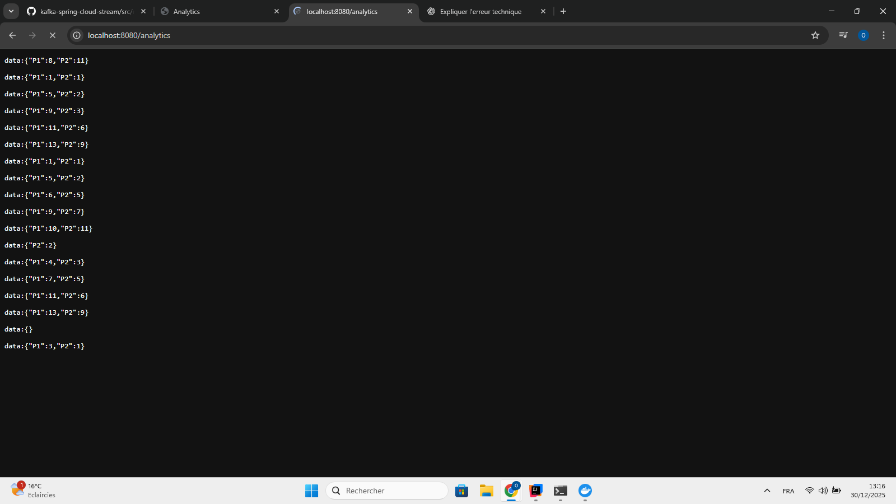
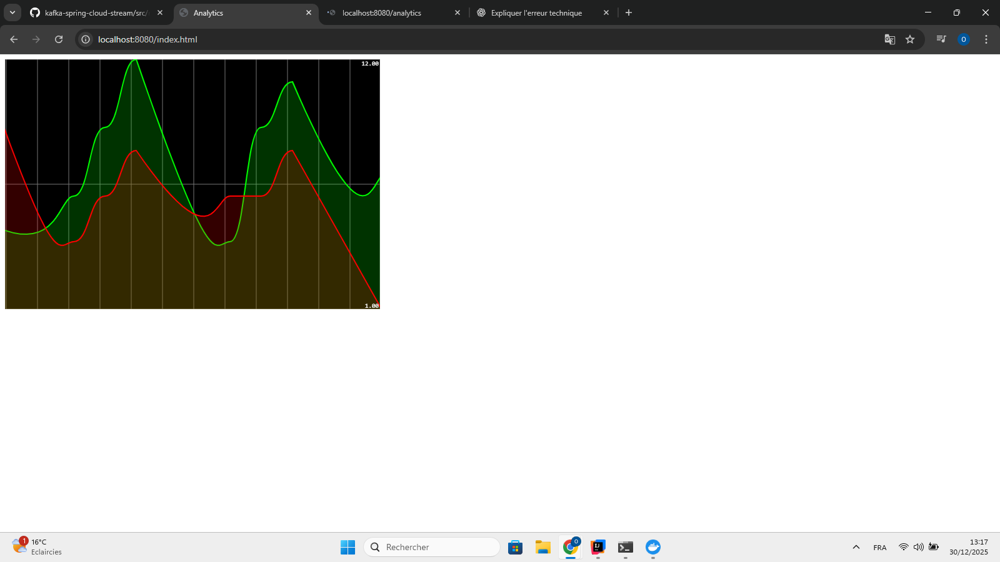

🚀 Mise en place de Kafka avec Docker
📦 Lancement de Kafka et Zookeeper

Pour déployer rapidement un environnement Kafka local, ce projet s’appuie sur Docker et Docker Compose.
L’utilisation des images officielles Confluent Kafka permet de lancer Kafka et Zookeeper de manière fiable et reproductible.

Le fichier docker-compose.yml ci-dessous permet de démarrer un broker Kafka ainsi que Zookeeper :

""" version: '3'
services:
zookeeper:
image: confluentinc/cp-zookeeper:7.3.0
container_name: bdcc-zookeeper
environment:
ZOOKEEPER_CLIENT_PORT: 2181
ZOOKEEPER_TICK_TIME: 2000

broker:
image: confluentinc/cp-kafka:7.3.0
container_name: bdcc-kafka-broker
ports:
- "9092:9092"
depends_on:
- zookeeper
environment:
KAFKA_BROKER_ID: 1
KAFKA_ZOOKEEPER_CONNECT: zookeeper:2181
KAFKA_LISTENER_SECURITY_PROTOCOL_MAP: PLAINTEXT:PLAINTEXT,PLAINTEXT_INTERNAL:PLAINTEXT
KAFKA_ADVERTISED_LISTENERS: PLAINTEXT://localhost:9092,PLAINTEXT_INTERNAL://broker:29092
KAFKA_OFFSETS_TOPIC_REPLICATION_FACTOR: 1
KAFKA_TRANSACTION_STATE_LOG_MIN_ISR: 1
KAFKA_TRANSACTION_STATE_LOG_REPLICATION_FACTOR: 1 """

🔄 Utilisation de Kafka
🧪 Commandes Kafka (CLI)

Une fois Kafka démarré, il est possible de manipuler les topics et les messages directement via les outils en ligne de commande Kafka.

▶️ Consommer des messages depuis un topic
docker exec --interactive --tty broker \
kafka-console-consumer --bootstrap-server broker:9092 --topic R2

▶️ Produire des messages vers un topic
docker exec --interactive --tty broker \
kafka-console-producer --broker-list broker:9092 --topic R2

📜 Affichage de l’historique des messages

☕ Intégration de Kafka avec Spring Boot
📤 Publication de messages via REST

Un RestController Spring permet de publier des messages Kafka via un endpoint HTTP /publish, en précisant :

le nom du producer

le topic cible

📥 Consommation de messages avec Spring Kafka

Au lieu d’utiliser un consumer en ligne de commande, un consumer Kafka est implémenté côté Spring, ce qui permet :

une meilleure intégration applicative

un traitement métier automatisé

une gestion centralisée des messages

⏱️ Production automatique avec Supplier

Un Supplier Spring Cloud Stream est utilisé pour envoyer automatiquement un message Kafka toutes les secondes, ce qui est utile pour :

simuler un flux continu d’événements

tester le traitement temps réel

📊 Analytics en temps réel (Kafka Streams + SSE)
🔎 Endpoint d’analytics temps réel

Une fonctionnalité avancée d’analyse temps réel a été implémentée à l’aide de Kafka Streams et des Server-Sent Events (SSE).

L’endpoint GET /analytics :

expose un flux continu de données

envoie automatiquement les mises à jour au client

Fonctionnement :

toutes les 1 seconde

interrogation du state store Kafka Streams count-store

récupération des données sur une fenêtre glissante des 5 dernières secondes

agrégation des résultats sous forme de Map<String, Long>

diffusion continue vers le client

Ce mécanisme permet une visualisation temps réel des événements sans rafraîchissement manuel.

🌐 Consommation côté Frontend

Côté frontend, l’API EventSource est utilisée pour se connecter à l’endpoint SSE /analytics et recevoir automatiquement les mises à jour en temps réel.

