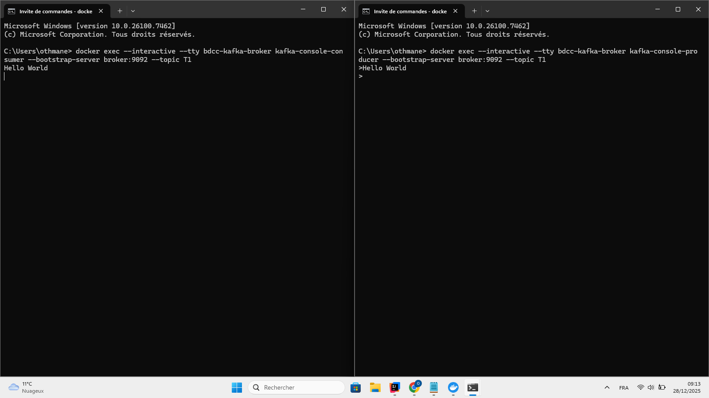
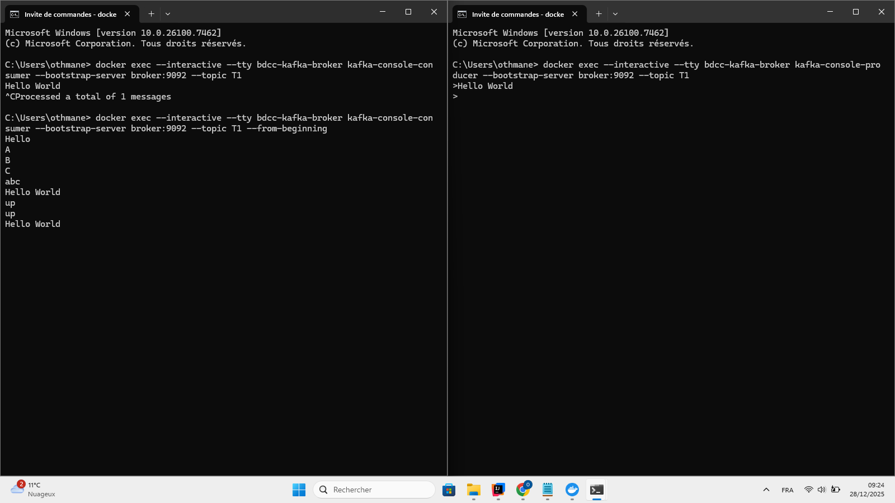
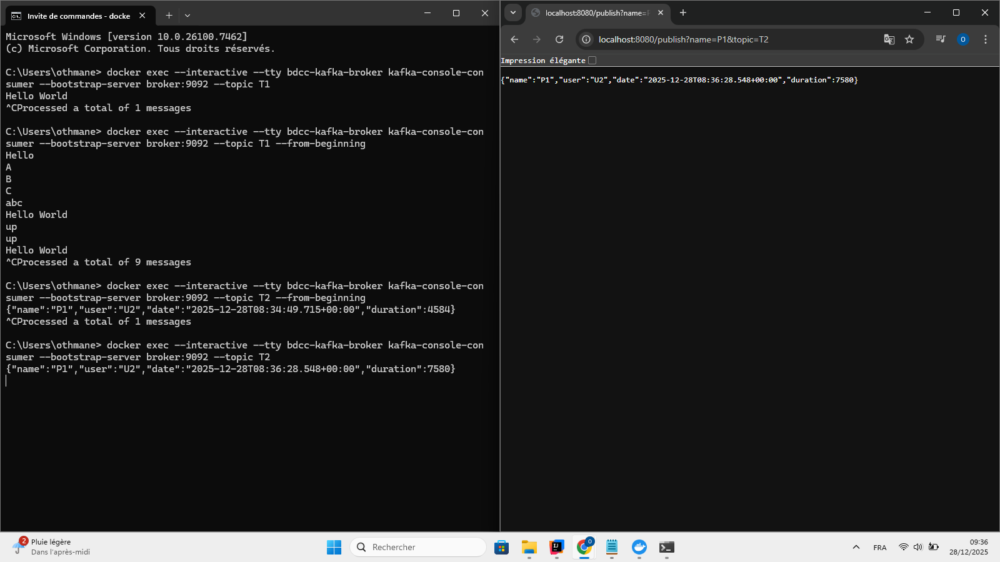
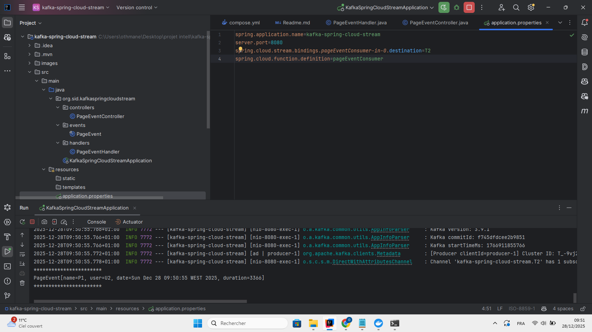
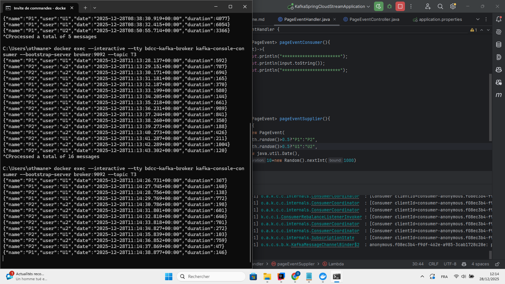

<h2>Lancement de kafka avec docker</h2>

Pour lancer kafka avec docker, il est possible d'utiliser <a href="https://hub.docker.com/r/bitnami/kafka/">l'image bitnami/kafka</a> qui permet de lancer kafka et zookeeper facilement.

Voici un exemple de commande docker-compose pour lancer kafka avec zookeeper :

version: '3'
services:
  zookeeper:
    image: confluentinc/cp-zookeeper:7.3.0
    container_name: bdcc-zookeeper
    environment:
      ZOOKEEPER_CLIENT_PORT: 2181
      ZOOKEEPER_TICK_TIME: 2000

broker:
image: confluentinc/cp-kafka:7.3.0
container_name: bdcc-kafka-broker
ports:
# To learn about configuring Kafka for access across networks see
# https://www.confluent.io/blog/kafka-client-cannot-connect-to-broker-on-aws-on-docker-etc/
- "9092:9092"
depends_on:
- zookeeper
environment:
KAFKA_BROKER_ID: 1
KAFKA_ZOOKEEPER_CONNECT: 'zookeeper:2181'
KAFKA_LISTENER_SECURITY_PROTOCOL_MAP: PLAINTEXT:PLAINTEXT,PLAINTEXT_INTERNAL:PLAINTEXT
KAFKA_ADVERTISED_LISTENERS: PLAINTEXT://localhost:9092,PLAINTEXT_INTERNAL://broker:29092
KAFKA_OFFSETS_TOPIC_REPLICATION_FACTOR: 1
KAFKA_TRANSACTION_STATE_LOG_MIN_ISR: 1
KAFKA_TRANSACTION_STATE_LOG_REPLICATION_FACTOR: 1

<h2>Utilisation de kafka</h2>
<h4>Commandes kafka</h4>

Une fois kafka lancé, il est possible d'utiliser les commandes kafka pour créer des topics, produire et consommer des messages.

Voici quelques exemples de commandes kafka :

<ul> Consumer des messages depuis un topic
<li> docker exec --interactive --tty broker kafka-console-consumer --bootstrap-server broker:9092 --topic R2
</li>
</ul>
<ul> Producer des messages vers un topic
<li> docker exec --interactive --tty broker kafka-console-producer --broker-list broker:9092 --topic R2
</li>
</ul>

Voici un exemple d'utilisatoion:

Voici comment afficher l'historique du topic :

<h4> Utilisation de Kafka via Spring</h4>

 Publier un message via RestController "/publish" en donnant le nom du producer et le nom du topic qui va recevoir le message 

Au lieu d'utiliser Console Consumer , on crée un consumer via spring

Utilisation du supplier qui permet d'enovoyer un message chaque seconde. 

